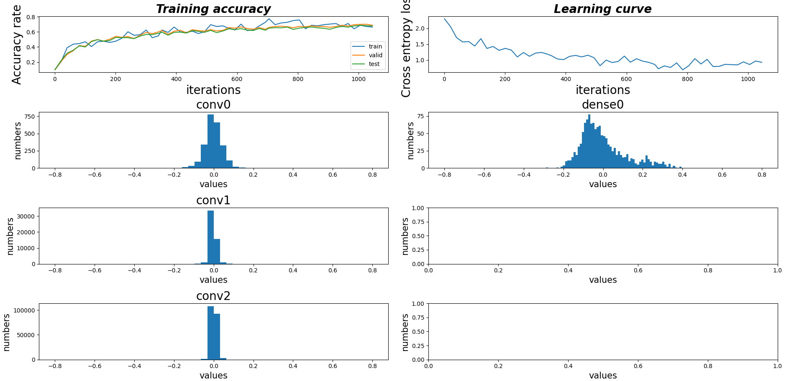

# build convolution neural network and batch norm backprop from scratch
Common Deep Learning Framework hides the backpropagation part of the neural network  
in the frontend, this is very convenient but sometimes makes it hard to understand,  
this repo implements the [Convolution Neural Network](http://vision.stanford.edu/cs598_spring07/papers/Lecun98.pdf) and [BatchNorm](https://arxiv.org/pdf/1502.03167.pdf) layer's backpropagation from scratch, we using pytorch just for gpu acceleration, we didn't use the automatic backprop function of the library.

### train the net
It's training on the CIFAR10 dataset
after training 3 epochs(about 5 minutes on a RTX3060GPU),  
you should get about 67 % test accuracy
```sh
python _1_train.py
```
### draw plots
```sh
python _2_test.py
```


